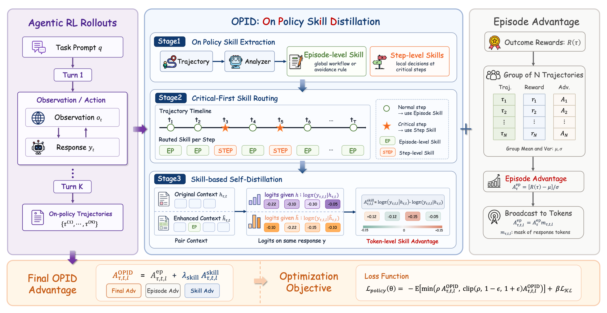
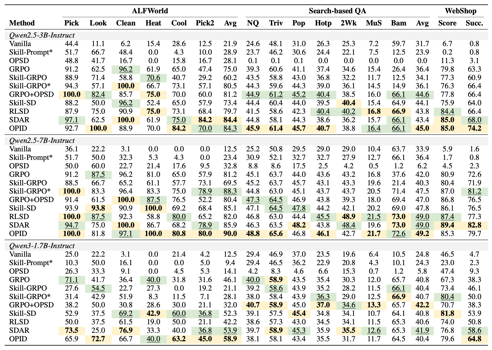

<h1 align="center">
OPID: On-Policy Skill Distillation for Agentic Reinforcement Learning
</h1>

  <div align="center">
  <p>
      <a href="https://arxiv.org/abs/2606.26790">
        
      </a>
      <a href="https://huggingface.co/papers/2606.26790">
        
      </a>
      <a href="https://huggingface.co/Jinyang23/OPID-ALFWorld-1.7B">
        
      </a>
    </p>
  </div>

## News

- **2026-06-25**: We have released our paper and code.

If you have any questions ❓ or are interested in collaboration 🤝, please feel free to contact me at 
wu-jy23@mails.tsinghua.edu.cn.


## Overview

We introduce **OPID**, an **On-Policy Skill Distillation** framework that turns completed
agent trajectories into hierarchical hindsight skills. OPID routes episode-level and step-level
skills during training to provide dense token-level supervision, while requiring no analyzer,
skill retrieval, or privileged context at inference time.

<div align="center">
  
  <br>
  <em>Figure 1: Overview of OPID.</em>
</div>

OPID achieves strong performance across ALFWorld, Search-based QA, and WebShop, improving over
outcome-only RL and competitive skill-distillation baselines.

<div align="center">
  
  <br>
  <em>Figure 2: Main results.</em>
</div>

## Installation

### Python Environment

```bash
conda create -n opid python==3.12 -y
conda activate opid

pip3 install vllm==0.11.0
pip3 install flash-attn==2.7.4.post1 --no-build-isolation --no-cache-dir
pip install -e .
```

Log in to Weights & Biases if you use WandB logging. Many example scripts use
`trainer.logger=['console','wandb']`.

```bash
export WANDB_API_KEY=your_key_here
```

OPID uses an LLM analyzer to extract episode-level and step-level hindsight skills during training.
Configure an OpenAI-compatible endpoint before running OPID scripts:

```bash
export OPENAI_API_KEY=your_key_here
export OPENAI_BASE_URL=https://your-openai-compatible-endpoint/v1
export OPENAI_MODEL=your_analyzer_model
export OPENAI_API_RETRIES=5
export OPENAI_API_RETRY_DELAY=1.0
```

Set the model root used by the training scripts:

```bash
export MODELS_ROOT=/path/to/models-and-checkpoints
```

### Install Supported Environments

#### 1. ALFWorld

```bash
pip3 install gymnasium==0.29.1
pip3 install stable-baselines3==2.6.0
pip3 install alfworld
```

Download PDDL and game files plus the pre-trained MaskRCNN detector:

```bash
alfworld-download -f
```

#### 2. WebShop

WebShop requires Python <=3.10, so begin by creating a separate environment:

```bash
conda create -n verl-webshop python==3.10 -y
conda activate verl-webshop
```

Install WebShop:

```bash
cd ./agent_system/environments/env_package/webshop/webshop
./setup.sh -d all
```

After WebShop is installed, return to the repo root and install the training package:

```bash
cd repo_root/
pip3 install torch==2.6.0 --index-url https://download.pytorch.org/whl/cu124
pip3 install flash-attn==2.7.4.post1 --no-build-isolation
pip3 install -e .
pip3 install vllm==0.8.2
```

Some WebShop dependencies may report `typer` compatibility warnings. They can be safely ignored.

#### 3. Search-Based QA

```bash
cd ./agent_system/environments/env_package/search/third_party
pip install -e .
pip install gym==0.26.2
```

Prepare the Search-R1 style dataset:

```bash
cd repo_root/
python examples/data_preprocess/preprocess_search_r1_dataset.py
```

The processed data is saved under `~/data/searchR1_processed_direct` by default.

Build a separate retrieval environment for the local search server:

```bash
conda create -n retriever python=3.10 -y
conda activate retriever

conda install numpy==1.26.4
pip install torch==2.6.0 torchvision==0.21.0 torchaudio==2.6.0 --index-url https://download.pytorch.org/whl/cu124
pip install transformers datasets pyserini huggingface_hub
conda install faiss-gpu==1.8.0 -c pytorch -c nvidia -y
pip install uvicorn fastapi
```

Download the index:

```bash
conda activate retriever

local_dir=~/data/searchR1
python examples/search/searchr1_download.py --local_dir $local_dir
cat $local_dir/part_* > $local_dir/e5_Flat.index
gzip -d $local_dir/wiki-18.jsonl.gz
```

Start the local flat e5 retrieval server:

```bash
conda activate retriever

bash examples/search/retriever/retrieval_launch.sh > retrieval_server.log
```

## Training

All OPID scripts live under `examples/opid_trainer/` and assume the repo root as the working directory.

```bash
bash examples/opid_trainer/run_alfworld_opid_guide.sh
bash examples/opid_trainer/run_webshop_opid_guide.sh
bash examples/opid_trainer/run_search_opid_guide.sh
```

Additional scripts are provided for Qwen3:

```bash
bash examples/opid_trainer/run_alfworld_opid_guide_qwen3.sh
bash examples/opid_trainer/run_webshop_opid_guide_qwen3.sh
bash examples/opid_trainer/run_search_opid_guide_qwen3.sh
```

Useful OPID parameters:

- `OPID_ANALYSIS_MAX_STEP_SKILLS_PER_TRAJ`: maximum number of critical step skills per trajectory.
- `OPID_EPISODE_SKILL_TEACHER_ADV_W`: weight for episode-level skill teacher advantage.
- `OPID_STEP_SKILL_TEACHER_ADV_W`: weight for step-level skill teacher advantage.


## Merge Checkpoints

See `scripts/model_merger.py` for FSDP/Megatron merge examples using paths under
`./checkpoints/...`.

## ⭐ Citation

If you find this project useful, welcome to cite us.

```bibtex
@misc{wu2026opid,
      title={OPID: On-Policy Skill Distillation for Agentic Reinforcement Learning},
      author={Shuo Yang and Jinyang Wu and Zhengxi Lu and Yuhao Shen and Fan Zhang and Lang Feng and Shuai Zhang and Haoran Luo and Zheng Lian and Zhengqi Wen and Jianhua Tao},
      year={2026},
      eprint={2606.26790},
      archivePrefix={arXiv},
      primaryClass={cs.LG},
      url={https://arxiv.org/abs/2606.26790}, 
}
```

## Acknowledgement

This project builds on [verl-agent](https://github.com/langfengQ/verl-agent),
[veRL](https://github.com/volcengine/verl),
[SkillRL](https://github.com/aiming-lab/SkillRL). We thank the authors of those projects.
